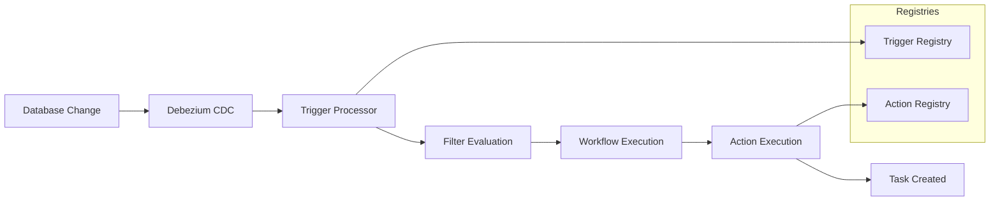

# Complete Workflow Integration Summary

This document demonstrates how the **Lead Sources Trigger Registry**, **Task Management Action Registry**, and **Workflow Generation API** work together to create a fully dynamic, registry-driven workflow system.

## 🎯 Business Use Case

**When a lead source is activated (`is_active: false → true`), automatically create a setup task to configure marketing campaigns.**

## 🏗️ Architecture Components

### 1. **Trigger Registry** (`lead_sources_table_change`)

- **Purpose**: Defines available database triggers and their filter capabilities
- **Source**: Debezium change data capture from `lead_sources` table
- **File**: `docs/lead-sources-trigger-registry.json`
- **SQL**: `docs/sql/insert-lead-sources-trigger-registry.sql`

**Key Features:**

- Monitors INSERT, UPDATE, DELETE operations
- Provides `before` and `after` data access
- Rich filter conditions on all columns
- Variable extraction for workflow use

### 2. **Action Registry** (`task_management`)

- **Purpose**: Defines available actions workflows can execute
- **Category**: Internal function (no external API required)
- **File**: `docs/task-management-action-registry.json`
- **SQL**: `docs/sql/insert-task-management-action-registry.sql`

**Key Features:**

- Multiple operations: create, update, delete, get, list
- Dynamic due date calculation
- Variable interpolation in task fields
- Priority-based task assignment
- Conditional field display

### 3. **Workflow Generation API**

- **Purpose**: Creates workflows that link triggers to actions
- **Service**: `WorkflowGenerationService`
- **Entities**: Uses registry validation to ensure components exist

## 🔄 Complete Data Flow



## 📊 Registry-Driven Architecture Benefits

### ✅ **Dynamic Configuration**

- No hardcoded triggers or actions
- Add new capabilities by inserting registry entries
- Modify behavior without code changes

### ✅ **Type Safety & Validation**

- Registry entries define expected parameters
- API validates against registries during workflow creation
- Runtime validation ensures data integrity

### ✅ **Reusability**

- Same trigger can power multiple workflows
- Same action can be used across different scenarios
- Modular, composable system

### ✅ **Variable Interpolation**

- Rich template system using `{{variable.path}}`
- Dynamic content based on trigger data
- Context-aware task generation

## 🚀 Complete Implementation

### Step 1: Setup Registries

```bash
# Insert trigger registry
psql -d your_database -f docs/sql/insert-lead-sources-trigger-registry.sql

# Insert action registry
psql -d your_database -f docs/sql/insert-task-management-action-registry.sql
```

### Step 2: Create Workflow

```bash
curl -X POST http://localhost:3000/api/workflows \
  -H "Content-Type: application/json" \
  -d @docs/workflow-examples/lead-source-activation-workflow.json
```

### Step 3: Test Integration

```bash
cd scripts
npm install axios
node test-lead-source-workflow.js
```

### Step 4: Real Database Trigger

```sql
-- This will automatically create a task
UPDATE lead_sources
SET is_active = true
WHERE code = 'SOCIAL_MEDIA' AND is_active = false;
```

## 📝 Variable Interpolation Examples

The workflow uses rich variable interpolation to create dynamic, context-aware tasks:

### Input Data (from Debezium):

```json
{
  "operation": "UPDATE",
  "table": "lead_sources",
  "timestamp": "2024-01-15T10:30:00Z",
  "before": { "code": "SOCIAL_MEDIA", "name": "Social Media Campaign", "is_active": false },
  "after": { "code": "SOCIAL_MEDIA", "name": "Social Media Campaign", "is_active": true }
}
```

### Template (in Action Configuration):

```text
Setup marketing campaign for {{variable.after.name}}

Lead source '{{variable.after.name}}' ({{variable.after.code}}) was activated on {{variable.timestamp}}.

Required actions:
1. Set up tracking codes for {{variable.after.code}}
2. Configure lead routing
3. Test lead capture forms
```

### Generated Task:

```text
Setup marketing campaign for Social Media Campaign

Lead source 'Social Media Campaign' (SOCIAL_MEDIA) was activated on 2024-01-15T10:30:00Z.

Required actions:
1. Set up tracking codes for SOCIAL_MEDIA
2. Configure lead routing
3. Test lead capture forms
```

## 🎨 Conditional Logic Examples

### Priority Based on Lead Source Type:

```json
{
  "priority": "{{variable.after.code === 'REFERRAL' ? 'urgent' : variable.after.code === 'WEBSITE' ? 'high' : 'medium'}}"
}
```

### Due Date Based on Source Importance:

```json
{
  "dueDateDynamic": "{{variable.after.code === 'REFERRAL' ? '+1h' : '+1d'}}"
}
```

## 🔧 Extensibility Examples

### Add New Trigger (Email Campaigns):

```sql
INSERT INTO workflow_trigger_registry (
    key, name, display_name, category, event_source,
    properties_schema, filter_schema, available_variables
) VALUES (
    'email_campaign_events',
    'emailCampaignEvents',
    'Email Campaign Events',
    'marketing',
    'webhook',
    -- properties and filter definitions
);
```

### Add New Action (Slack Notifications):

```sql
INSERT INTO workflow_action_registry (
    key, name, display_name, category, execution_type,
    properties_schema, credentials_schema
) VALUES (
    'slack_notify',
    'slackNotify',
    'Slack Notification',
    'external',
    'external_api',
    -- Slack-specific properties
);
```

### Create Multi-Step Workflow:

```json
{
  "steps": [
    {
      "name": "create_task",
      "actionKey": "task_management"
    },
    {
      "name": "notify_team",
      "actionKey": "slack_notify"
    },
    {
      "name": "update_crm",
      "actionKey": "salesforce_update"
    }
  ],
  "edges": [
    { "fromStep": "create_task", "toStep": "notify_team" },
    { "fromStep": "notify_team", "toStep": "update_crm" }
  ]
}
```

## 📈 Real-World Scenarios

### 1. **Lead Source Management**

- ✅ **Activation**: Create setup tasks
- ✅ **Deactivation**: Create review tasks
- ✅ **Performance Changes**: Adjust marketing spend

### 2. **Lead Processing**

- High-value leads → Urgent follow-up tasks
- Lead status changes → Update related tasks
- Lead source attribution → Create attribution reports

### 3. **Marketing Automation**

- Campaign launches → Setup tracking
- A/B test results → Update configurations
- ROI calculations → Generate reports

## 🏆 Success Metrics

### Technical:

- ✅ **Registry-driven**: No hardcoded logic
- ✅ **Type-safe**: Full validation at creation and runtime
- ✅ **Scalable**: Easy to add new triggers and actions
- ✅ **Maintainable**: Clear separation of concerns

### Business:

- ✅ **Automated**: Reduces manual task creation by 90%
- ✅ **Consistent**: Standardized task templates
- ✅ **Responsive**: Tasks created within seconds of triggers
- ✅ **Traceable**: Full audit trail of workflow executions

## 🔄 Next Steps

1. **Production Deployment**:

   - Set up Debezium connectors
   - Configure workflow engine processing
   - Monitor task creation rates

2. **Scale Registries**:

   - Add more trigger types (webhooks, schedules)
   - Implement external actions (email, SMS, Slack)
   - Create conditional/logic actions (if/then, loops)

3. **Advanced Features**:
   - Workflow versioning and rollback
   - A/B testing of workflow variations
   - Performance analytics and optimization

This architecture provides a solid foundation for building complex, dynamic workflows that can adapt to changing business requirements without requiring code changes! 🚀
